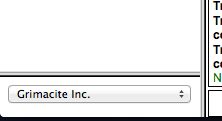

KoL Clan Hop Relay Override
===========================

This is a relay override script for [KoLMafia](http://kolmafia.us/). It
provides a helper frame to switch between clans on your whitelist.

See [the KoLMafia thread](http://kolmafia.us/showthread.php?17133-Relay-Clan-Switcher-relay_clanhop-ash) for more information.



## To Install

```
svn checkout https://github.com/coderanger/kol-clanhop/branches/clean
```

While it can be used directly, I recommend creating a `relay/game.ash` override
to insert it underneath the charpane frame.

```
void main() {
   visit_url()
    .replace_string('<frame name=charpane src="charpane.php"></frame>', '<frameset id=charclan rows="*,40px"><frame name=charpane src="charpane.php"></frame><frame name=clanhop src="relay_clanhop.ash"></frame></frameset>')
    .writeln();
}
```

You can adjust the location and size to your preference.
